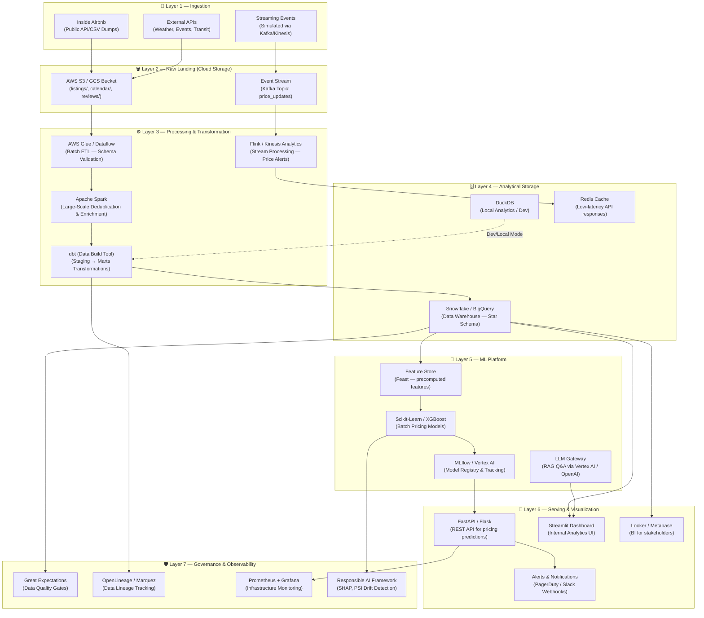

# HostLens — Production Cloud Architecture

> **Document Type**: Architecture Reference  
> **Audience**: Engineering / Platform Teams  
> **Status**: Draft v1.0

---

## Overview

HostLens is designed as a modern, cloud-native data platform capable of scaling from a single-city proof-of-concept to a multi-region, multi-city deployment processing millions of Airbnb-equivalent listing events per day. This document describes the production architecture, cost estimates per layer, and trade-off analysis for key design decisions.

---

## End-to-End Architecture Diagram



---

## Layer-by-Layer Cost Estimates

*Estimates assume processing 5 million listing records per month, 1TB data warehouse, 2 ML training jobs/day.*

| Layer | Service | Configuration | Est. Monthly Cost (USD) |
|:---|:---|:---|---:|
| **Ingestion** | AWS Glue Crawlers | 10 DPU-hours/day | $43 |
| **Landing Storage** | AWS S3 Standard | 500 GB raw data | $11 |
| **Stream Processing** | AWS Kinesis Analytics | 2 KPUs, 8h/day | $128 |
| **Batch ETL** | AWS Glue ETL Jobs | 20 DPU-hours/day | $87 |
| **Data Warehouse** | Snowflake (On-Demand) | 2 X-Small warehouses | $230 |
| **ML Training** | AWS SageMaker | ml.m5.large, 2h/day | $90 |
| **Feature Store** | Feast on Redis | r6g.large Redis | $105 |
| **LLM (RAG)** | OpenAI API (GPT-4o) | 2M tokens/month | $20 |
| **Serving API** | AWS ECS Fargate | 0.5 vCPU, 1GB RAM × 2 | $35 |
| **Dashboard** | Streamlit Cloud / ECS | 2 vCPU, 4GB RAM | $60 |
| **Monitoring** | Grafana Cloud Free Tier | 10k metrics/month | $0 |
| **Data Quality** | Great Expectations OSS | Self-hosted | $0 |
| **Total** | | | **~$809/month** |

> **Note**: At multi-city scale (50 cities), costs scale approximately linearly for storage/processing but sub-linearly for ML serving (shared model). Estimated total at 50 cities: **~$3,200/month** with BigQuery replacing Snowflake for cost savings.

---

## Alternative Architecture Comparison

| Architecture | Latency | Scalability | Cost/Month | Complexity | Best For |
|:---|:---:|:---:|---:|:---:|:---|
| **DuckDB + Local (Current)** | <1s | Single node | $0 | Low | Dev/POC |
| **BigQuery + Dataflow** | 2–5s | Global | ~$400 | Medium | Growing teams |
| **Snowflake + Spark** | 3–8s | Enterprise | ~$800 | High | Large enterprises |
| **Databricks Lakehouse** | 1–3s | Global | ~$1,200 | High | Data science teams |
| **AWS Native (Redshift+Glue)** | 2–6s | Regional | ~$650 | Medium | AWS-committed orgs |

---

## Key Design Decisions & Trade-offs

### Decision 1: DuckDB vs. BigQuery for Analytics
| Factor | DuckDB | BigQuery |
|:---|:---|:---|
| **Setup Time** | Minutes | Hours (IAM, billing) |
| **Cost at Small Scale** | $0 | $5/TB queried |
| **Concurrent Users** | Limited (1 writer) | Thousands |
| **Verdict** | ✅ Chosen for POC | → Migrate at >10 concurrent users |

### Decision 2: Batch vs. Stream Processing
| Factor | Batch (Current) | Stream (Planned) |
|:---|:---|:---|
| **Data Freshness** | Hours | Seconds |
| **Infrastructure Cost** | Low | 3–4× higher |
| **Complexity** | Low | High |
| **Use Case** | Historical analytics | Real-time alerts |
| **Verdict** | ✅ Chosen for analytics | Stream for price monitoring only |

### Decision 3: Self-hosted ML vs. Managed (Vertex AI/SageMaker)
| Factor | Self-hosted (Scikit-Learn) | Managed (Vertex AI) |
|:---|:---|:---|
| **Model Portability** | High | Vendor lock-in risk |
| **MLOps Features** | Manual | Built-in |
| **Cost** | Compute only | 30–40% premium |
| **Verdict** | ✅ Chosen for POC | → Migrate at >20 models |

---

## Scalability Roadmap

```
Phase 1 (Current) → Phase 2 (6 months) → Phase 3 (18 months)
DuckDB + Local         BigQuery + Airflow     Snowflake + Spark + Kafka
Single-city           5 cities              50+ cities
$0/month              ~$400/month           ~$3,200/month
```
